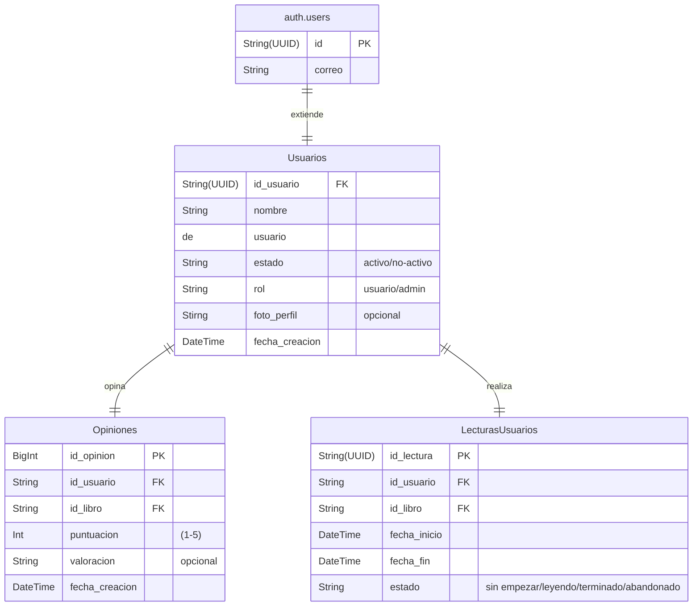
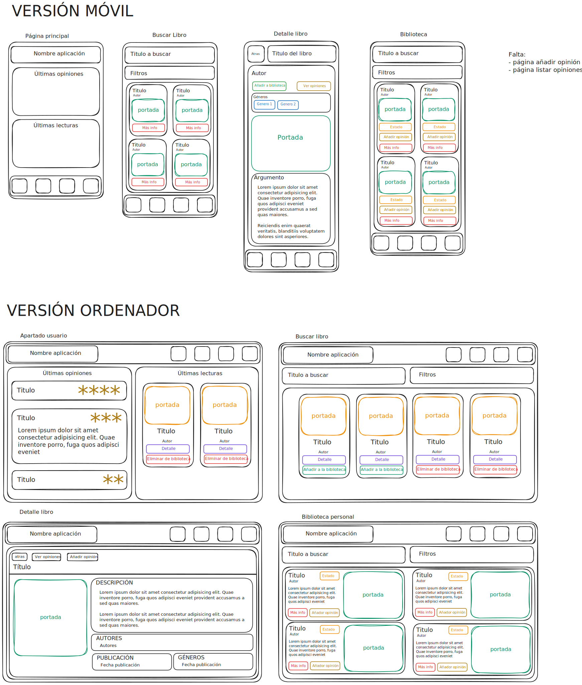

# Proyecto-2-DAW

## INTRODUCCIÓN Y OBJETIVOS

### Motivación:

### Objetivos:

### Alcance:
La aplicación consiste en llevar un registro de los libros leidos por cada usuario, así como compartir las opiniones que tienen los mismos sobre estos.

No es una aplicación de lecturas ni de compraventa de libros. 

## ANÁLISIS
### Requisitos funcionales:

### Requisitos no funcionales:

### Casos de uso:

## DISEÑO

## TECNOLOGÍAS UTILIZADAS
### Frontend:
Para el desarrollo del frontend se ha utilizado el framework de [React](https://es.react.dev/). Como apollo para la creación del Frontend se ha utilizado librerías de componentes, como: [Boneyard-js](https://github.com/0xGF/boneyard) para los Skeletons de carga de página, [Material UI (MUI)](https://mui.com/material-ui/) para algunos componentes.
### Backend:
Para el desarrollo del backend se ha utilizado [NestJS](https://nestjs.com/) como framework y [Prisma](https://www.prisma.io/) como ORM.
### Base de Datos:
Para la base de datos se ha utilizado [Supabase](https://supabase.com/), en parte por si gestión de usuarios integrada en el servidor de bases de datos.
### Herramientas de apoyo:
También se han utilizado otras herrameitnas de apoyo:
- [GitHub](https://github.com/) -> Control de versiones
- [Excalidraw](https://excalidraw.com/) -> diseño del prototipo
- [Open Library Book Search API](https://openlibrary.org/dev/docs/api/search) -> como base de datos de libros

## DISEÑO
### Arquitectura de la aplicación:
### Modelo de datos:

#### Usuario

| Campo          | Tipo          | Descripción                                   |
| ----------------| ---------------| -----------------------------------------------|
| id             | String (UUID) | Identificador único del usuario               |
| nombre_usuario | String        | Nombre de usuario                             |
| estado         | String        | Estado del usuario (por defecto: "no-activo") |
| rol            | String        | Rol del usuario (por defecto: "usuario")      |
| foto_perfil    | String?       | URL de la foto de perfil (opcional)           |
| fecha_creacion | DateTime      | Fecha de creación del usuario                 |

**Relaciones:**
- Un usuario puede tener muchas opiniones
- Un usuario puede tener muchas lecturas

#### Opiniones

| Campo          | Tipo     | Descripción                                |
| ----------------| ----------| --------------------------------------------|
| id_opinion     | BigInt   | Identificador único de la opinión          |
| id_usuario     | String   | FK al usuario que crea la opinión          |
| id_libro       | String   | Identificador del libro                    |
| puntuacion     | Int      | Puntuación dada al libro (1-5)             |
| valoracion     | String?  | Comentario o valoración textual (opcional) |
| fecha_creacion | DateTime | Fecha de creación de la opinión            |

**Relaciones:**
- Cada opinión pertenece a un usuario

#### LecturasUsuarios

| Campo        | Tipo          | Descripción                                        |
| --------------| ---------------| ----------------------------------------------------|
| id_lectura   | String (UUID) | Identificador único de la lectura                  |
| id_usuario   | String        | FK al usuario                                      |
| id_libro     | String        | Identificador del libro                            |
| fecha_inicio | DateTime?     | Fecha de inicio de la lectura (opcional)           |
| fecha_fin    | DateTime?     | Fecha de fin de la lectura (opcional)              |
| estado       | String        | Estado de la lectura (ej: "leyendo", "completado") |

**Relaciones:**
- Cada lectura pertenece a un usuario

#### Diagrama

### Diseño de la interfaz:

#### Diseños iniciales en Excalidraw

## DESARROLLO

## PRUEBAS

## RECURSOS

### Alojamientos:
#### Frontend:
El frontend de la aplicación se ha desplegado en [Vercel](https://vercel.com).
Se ha decidido usar Vercel por la facilildad que tiene de despliegue, las características del plan gratuito y su integración con los proyectos de GitHub.
#### Backend:
El backend de la aplicación se ha desplegado en [Render](https://render.com/)
#### Base de datos:
La base de datos se ha creado en [Supabase](https://supabase.com/).

## CASOS DE USO

## OPCIONES A MEJORAR

## ANEXOS A ESTRACTOS DE CÓDIGO

## BIBLIOGRAFÍA

- [Documentación Supabase](https://supabase.com/docs).
- [Documentación Vercel](https://vercel.com/docs).
- [Documentación Render](https://render.com/docs).
- [Documentación Nest](https://docs.nestjs.com/).
- [Documentación React](https://react.dev/learn/)
- [Documentación Open Library](https://openlibrary.org/dev/docs/api/search)

- [Documentación Backend](./documentacion-backend.md).